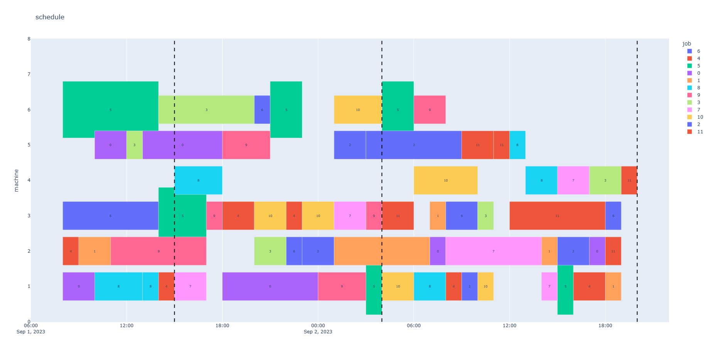

**重调度方式对指定时刻添加新订单的柔性车间问题进行求解:以算例MK01为例**

### 柔性车间调度问题

  柔性车间调度问题可描述为：多个工件在多台机器上加工，工件安排加工时严格按照工序的先后顺序，至少有一道工序有多个可加工机器，在某些优化目标下安排生产。
柔性车间调度问题的约束条件如下：

- （1）同一台机器同一时刻只能加工一个工件;
- （2）同一工件的同一道工序在同一时刻被加工的机器数是一;
- （3）任意工序开始加工不能中断;
- （4）各个工件之间不存在的优先级的差别;
- （5）同一工件的工序之间存在先后约束，不同工件的工序之间不存在先后约束;
- （6）所有工件在零时刻都可以被加工。

MK01算例：

10 6 2
**6** *2 1 5 3 4* 3 5 3 3 5 2 1 2 3 4 6 2 3 6 5 2 6 1 1 1 3 1 3 6 6 3 6 4 3  
5 1 2 6 1 3 1 1 1 2 2 2 6 4 6 3 6 5 2 6 1 1 
5 1 2 6 2 3 4 6 2 3 6 5 2 6 1 1 3 3 4 2 6 6 6 2 1 1 5 5 
5 3 6 5 2 6 1 1 1 2 6 1 3 1 3 5 3 3 5 2 1 2 3 4 6 2
6 3 5 3 3 5 2 1 3 6 5 2 6 1 1 1 2 6 2 1 5 3 4 2 2 6 4 6 3 3 4 2 6 6 6
6 2 3 4 6 2 1 1 2 3 3 4 2 6 6 6 1 2 6 3 6 5 2 6 1 1 2 1 3 4 2
5 1 6 1 2 1 3 4 2 3 3 4 2 6 6 6 3 2 6 5 1 1 6 1 3 1
5 2 3 4 6 2 3 3 4 2 6 6 6 3 6 5 2 6 1 1 1 2 6 2 2 6 4 6
6 1 6 1 2 1 1 5 5 3 6 6 3 6 4 3 1 1 2 3 3 4 2 6 6 6 2 2 6 4 6
6 2 3 4 6 2 3 3 4 2 6 6 6 3 5 3 3 5 2 1 1 6 1 2 2 6 4 6 2 1 3 4 2 

第一行的10,6是工件数和机器数。

第二行第一个加粗的数字6表示，工件1有6道工序。斜体的2 1 5 3 4，表示工件1的第一道工序有两个可选机器，分别是1和3，加工时间是5和4，后面的3 5 3 3 5 2 1表示工件1的第二道工序有3个可选机器，分别是5,3,2，加工时间是3,5,1，一行就是1个工件的所有工序的可选机器可加工时间，后面的工序以此类推。

下面的每一行以此类推。

### 特定时间新订单插入

动态问题更符合实际，实际生产中容易出现机器故障、紧急订单等突发状况，解决这些问题至关重要，本文介绍机器故障下的柔性车间调度问题的解决方式，其他问题大同小异。

特定时间新订单插入对应的参数有：到达时间、订单信息包括（工序数目，相应可处理的机器和处理时间）

假设：同一时刻下其他正在进行生产任务的机器任务不能中断。

new_operation = {7:[6,[3,6,1,3,2,6,2,6,2,1,1,4],[4,2,2,4,6,6,6,5,6,1,3,2],[2,1,3,1,3,2],[2,3,6,7,10,12]],
20:[6,[3,6,1,3,2,6,2,6,2,1,1,4],[4,2,2,4,6,6,6,5,6,1,3,2],[2,1,3,1,3,2],[2,3,6,7,10,12]]}

表明7时刻订单包含6个工序，可以处理个工序的机器（将他们一次列出）（[3,6,1,3,2,6,2,6,2,1,1,4]），对应处理时间（[4,2,2,4,6,6,6,5,6,1,3,2]），可处理每个工序的机器数（[2,1,3,1,3,2]），可处理每个工序的机器数的累加和（[2,3,6,7,10,12]），20时刻的可以此得到订单信息

甘特图：

(该解具有合理性，但某些block的宽度确实也存在问题)

### 完全重调度下故障问题解决

保持新订单到达前的调度方案不变，对到达的生产任务重新安排，采用切分的方式，重新生成工序、机器、加工时间编码，并用遗传算法对重新生成的编码进行寻优.

